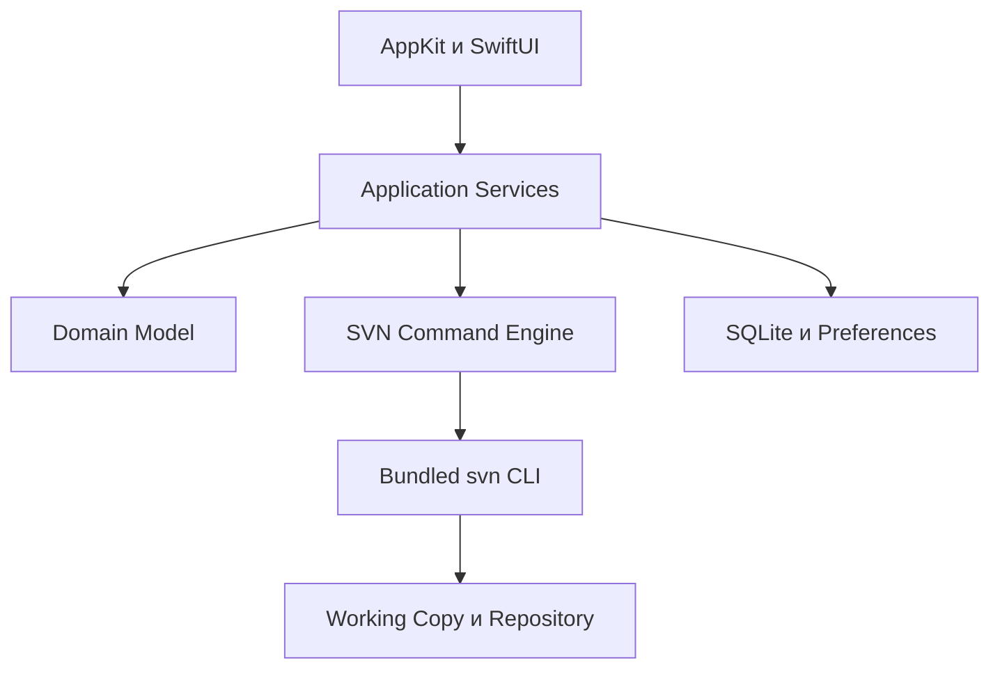

# Spoon — продуктовая и техническая спецификация

**Версия документа:** 0.2  
**Статус:** проект спецификации для начала разработки  
**Дата:** 5 августа 2026 года  
**Целевой релиз:** Spoon 1.0 для macOS

## 1. Назначение документа

Документ определяет назначение Spoon 1.0, пользовательские сценарии, требования к интерфейсу, архитектуру приложения, правила запуска SVN-команд, безопасность, производительность, тестирование и критерии приёмки.

Spoon — нативный графический SVN-клиент для macOS. По скорости работы и ясности интерфейса он ориентируется на Fork, но является самостоятельным продуктом, учитывающим централизованную модель и особенности Subversion.

Все операции с репозиторием и рабочей копией Spoon выполняет через поставляемый вместе с приложением официальный клиент `svn`. Состояние working copy и структура `.svn` полностью обслуживаются самим SVN-клиентом.

## 2. Цель продукта

Spoon должен позволять разработчику выполнять повседневную работу с SVN без терминала:

- открыть рабочую копию и сразу увидеть её состояние;
- просмотреть изменения файлов и свойств;
- выбрать конкретные файлы для commit;
- обновить рабочую копию;
- изучить историю и состав любой ревизии;
- работать с ветками, тегами, switch и merge через понятные мастера;
- увидеть и разрешить конфликты;
- получить нормальное объяснение ошибки и при необходимости открыть точный диагностический вывод SVN.

## 3. Принципы Spoon

1. **Нативный macOS-интерфейс.** AppKit, системные меню, окна, горячие клавиши, Keychain, светлая и тёмная темы, VoiceOver, code signing и notarization.
2. **SVN — единственный источник истины.** Spoon получает и изменяет состояние рабочей копии только через официальные SVN-команды.
3. **Безопасность по умолчанию.** Revert, удаление файлов, switch, merge и серверные операции всегда показывают область воздействия.
4. **Интерфейс не блокируется.** Все команды выполняются асинхронно, вывод поступает потоково, операцию можно отменить.
5. **Прозрачность.** Пользователь может открыть очищенную от секретов команду, stdout, stderr, код завершения и SVN error code.
6. **Постепенное усложнение.** Основные действия доступны сразу, расширенные параметры вынесены в дополнительные настройки.
7. **Самостоятельный дизайн.** Spoon использует собственную кодовую базу и визуальную систему, а Fork служит ориентиром удобства.

## 4. Целевая аудитория

- разработчики коммерческих и legacy-проектов в SVN;
- команды разработки игр и мобильных приложений;
- проекты с большими бинарными файлами и SVN locks;
- build- и release-инженеры;
- технические художники и контент-команды;
- пользователи TortoiseSVN, перешедшие с Windows на macOS.

## 5. Платформа и совместимость

### 5.1 Операционная система

- macOS 13 и новее;
- Spoon 1.0 поставляется как Universal-приложение для Apple Silicon и Intel.

### 5.2 SVN

- Вместе со Spoon поставляется SVN 1.14 LTS со всеми необходимыми динамическими библиотеками.
- Точная patch-версия отображается в About и включается в диагностику.
- Установка Homebrew пользователю не требуется.
- В настройках можно разрешить использование внешнего `svn`, но только после проверки версии и возможностей.
- Spoon не обновляет формат working copy автоматически.
- Если рабочей копии требуется upgrade, Spoon объясняет последствия и предлагает отдельное явное действие.

### 5.3 Поддерживаемые URL

- `http://`
- `https://`
- `svn://`
- `svn+ssh://`
- `file://`

## 6. Функциональность Spoon 1.0

Spoon 1.0 включает:

- добавление существующей working copy;
- checkout новой working copy;
- локальный status;
- remote status;
- отображение изменённых, добавленных, удалённых, отсутствующих, конфликтных и unversioned-файлов;
- просмотр текстового diff;
- add, delete, revert и resolve;
- выбор файлов и commit;
- update и безопасный cleanup;
- историю ревизий и diff выбранной ревизии;
- Repository Browser;
- просмотр и экспорт файлов из репозитория без checkout;
- blame;
- SVN properties;
- changelists;
- locks;
- externals;
- создание веток и тегов через repository-side copy;
- switch;
- merge и reverse merge;
- текстовые, property- и tree-конфликты;
- HTTPS- и SSH-аутентификацию;
- запуск внешнего merge-инструмента;
- очередь операций, прогресс, отмену и диагностику;
- сравнение изображений;
- настройку внешних diff/merge-программ;
- оптимизацию для больших рабочих копий;
- автоматические обновления Spoon;
- полную поддержку управления с клавиатуры и VoiceOver;
- подписанную и notarized-сборку.

## 7. Термины

| Термин | Значение |
|---|---|
| Repository | Локальный или удалённый SVN-репозиторий |
| Working copy | Локальная рабочая копия SVN |
| Проект | Запись Spoon, указывающая на корень working copy |
| Revision | Глобальная числовая ревизия SVN-репозитория |
| Local Changes | Неотправленные изменения working copy |
| Remote Changes | Изменения репозитория новее состояния working copy |
| Branch | Каталог репозитория, созданный через `svn copy` и используемый как ветка |
| Tag | Каталог репозитория, созданный через `svn copy` и используемый как тег |
| Task | Одна поставленная в очередь, выполняемая или завершённая SVN-операция |
| Commit Selection | Хранимый Spoon набор файлов для следующего commit |

## 8. Пользовательский интерфейс

### 8.1 Главное окно

Главное окно состоит из трёх областей:

1. **Sidebar слева:** проекты, группы проектов, основные разделы и активные задачи.
2. **Content по центру:** изменения, история, Repository Browser или список конфликтов.
3. **Inspector справа или снизу:** diff, свойства файла, данные ревизии или действия с конфликтом.

Положение Inspector и размеры панелей сохраняются отдельно для каждого окна.

### 8.2 Разделы проекта

- Local Changes
- History
- Repository Browser
- Branches and Tags
- Changelists
- Conflicts
- Tasks

### 8.3 Local Changes

Экран содержит:

- название проекта, repository URL и текущую ревизию;
- Refresh и Check Remote;
- фильтр по пути, статусу, changelist и тексту;
- переключение между плоским списком и деревом каталогов;
- checkbox выбора для commit;
- commit message;
- список выбранных файлов и общий размер изменений;
- Inspector с diff;
- контекстные действия add, delete, move, revert, resolve, lock и properties.

Commit Selection хранится в базе Spoon. Он не изменяет метаданные SVN и не называется staging area.

### 8.4 History

Экран содержит:

- список ревизий от новых к старым;
- номер, автора, дату и первую строку сообщения;
- постраничную загрузку;
- поиск по номеру, автору, тексту и изменённому пути;
- список файлов выбранной ревизии;
- тип изменения и `copy-from` при наличии;
- diff ревизии;
- сравнение двух ревизий;
- переход к blame и исторической версии файла.

История отображается как timeline с последовательностью SVN-ревизий.

### 8.5 Repository Browser

Repository Browser обеспечивает:

- ленивую загрузку дерева каталогов;
- выбор HEAD или конкретной ревизии;
- просмотр файла через `svn cat`;
- копирование URL и repository-relative path;
- checkout выбранного каталога;
- mkdir, copy, move, rename и delete с обязательным commit message;
- создание branch или tag с предварительным просмотром source/destination.

Для исторической ревизии изменяющие операции недоступны.

### 8.6 Task Center

Каждая команда создаёт Task со следующими данными:

- тип операции;
- проект и цели;
- состояние: queued, running, succeeded, failed или cancelled;
- время начала и продолжительность;
- потоковый прогресс;
- очищенная от секретов команда;
- stdout и stderr;
- найденные SVN error codes;
- безопасные действия Retry, Copy Diagnostics и Reveal in Finder.

Закрытие окна не отменяет задачу. При выходе из Spoon во время изменяющей операции пользователь выбирает: дождаться, отменить выход или остановить операцию.

### 8.7 Общие требования интерфейса

- Все основные действия доступны через меню и Command Palette.
- Интерфейс полностью управляется с клавиатуры.
- Контекстное меню содержит только применимые к выбору команды.
- Любая долгая операция показывает прогресс и кнопку Cancel.
- Опасные действия показывают канонический путь или URL и область воздействия.
- Все строки вынесены в localization resources.
- Базовый язык 1.0 — английский; архитектура готова к добавлению других языков.

## 9. Функциональные требования

### 9.1 Проекты и рабочие копии

| ID | Требование |
|---|---|
| APP-001 | Пользователь может выбрать любой путь внутри working copy; Spoon определяет и сохраняет её корень. |
| APP-002 | Удаление проекта из Spoon не удаляет локальные файлы. |
| APP-003 | После перезапуска восстанавливаются окна, выбранные проекты, панели, фильтры и сортировка. |
| APP-004 | Проект можно открыть в Finder, Terminal и настроенном редакторе. |
| APP-005 | Проекты можно объединять в группы и добавлять в Favorites. |
| APP-006 | Одна working copy не может быть добавлена дважды через разные вложенные пути. |
| APP-007 | Для перемещённой working copy доступны Locate и Remove. |
| APP-008 | Разные проекты можно открыть в отдельных окнах. |
| WC-001 | Checkout поддерживает URL, локальный путь, revision, depth и обработку externals. |
| WC-002 | Отображаются repository root URL, UUID, relative URL, working-copy root и revision. |
| WC-003 | Sparse depth, switched paths и externals явно обозначаются. |
| WC-004 | Spoon обнаруживает locked working copy и предлагает безопасный cleanup. |

### 9.2 Status и изменения

| ID | Требование |
|---|---|
| CHG-001 | Отображаются versioned и unversioned local changes. |
| CHG-002 | File status и property status представлены раздельно. |
| CHG-003 | Modified, added, deleted, missing, replaced, conflicted, obstructed, copied, switched, locked и ignored различимы визуально и текстом. |
| CHG-004 | Поддерживаются фильтрация, сортировка и выбор нескольких путей. |
| CHG-005 | Изменения файловой системы запускают один отложенный status refresh. |
| CHG-006 | Пользователь может отдельно запросить remote-aware status. |
| CHG-007 | Ignored-файлы скрыты по умолчанию и отображаются только явно. |
| CHG-008 | Большие результаты отображаются порциями без блокировки интерфейса. |

### 9.3 Операции с файлами

| ID | Требование |
|---|---|
| FILE-001 | Add работает для выбранных файлов и каталогов. |
| FILE-002 | Delete планирует удаление versioned-объектов через SVN. |
| FILE-003 | Revert показывает список затрагиваемых путей и требует подтверждения. |
| FILE-004 | Recursive revert отдельно показывает root, depth и количество объектов. |
| FILE-005 | Rename и move выполняются через `svn move`. |
| FILE-006 | Поддерживаются lock и unlock с необязательным сообщением. |
| FILE-007 | Пользователь может просматривать, добавлять, изменять и удалять properties. |
| FILE-008 | Поддерживаются назначение и удаление SVN changelist. |
| FILE-009 | Удаление unversioned и ignored отделено от cleanup и всегда показывает предварительный список. |

### 9.4 Diff

| ID | Требование |
|---|---|
| DIFF-001 | Доступны unified и side-by-side представления текстового diff. |
| DIFF-002 | Добавленные и удалённые файлы можно просмотреть полностью или порциями. |
| DIFF-003 | Можно скрыть whitespace-only изменения на уровне представления. |
| DIFF-004 | Для бинарного файла показываются метаданные, Open и Reveal вместо ложного текстового diff. |
| DIFF-005 | PNG, JPEG, GIF, WebP и другие согласованные форматы получают before/after preview. |
| DIFF-006 | Property diff отображается отдельно от content diff. |
| DIFF-007 | Можно настроить внешнюю diff-программу. |
| DIFF-008 | Большой diff загружается потоково или передаётся внешнему инструменту после настраиваемого порога. |

### 9.5 Commit

| ID | Требование |
|---|---|
| COM-001 | Можно выбрать корректное подмножество изменений для commit. |
| COM-002 | Перед запуском показываются итоговые targets и сообщение. |
| COM-003 | Сообщение передаётся через временный файл с правами только для пользователя. |
| COM-004 | Большой список targets передаётся через SVN targets file. |
| COM-005 | Commit невозможен при наличии выбранного unresolved conflict. |
| COM-006 | После успешного commit обновляются status и history. |
| COM-007 | После ошибки сохраняются draft сообщения и выбор файлов. |
| COM-008 | Доступна локальная история сообщений и восстановление незавершённого draft. |
| COM-009 | Настраиваемые проверки предупреждают о пустом сообщении, длинной первой строке и отсутствии issue ID. |
| COM-010 | Результат показывает номер созданной ревизии. |

### 9.6 Update и cleanup

| ID | Требование |
|---|---|
| SYNC-001 | Update выполняется для всей working copy или выбранных targets. |
| SYNC-002 | Поддерживаются HEAD и конкретная revision. |
| SYNC-003 | Конфликтная стратегия по умолчанию — postpone. |
| SYNC-004 | Вывод update поступает в Task потоково. |
| SYNC-005 | Обычный cleanup никогда не удаляет unversioned или ignored. |
| SYNC-006 | Расширенные cleanup-флаги включаются отдельно и объясняют последствия. |
| SYNC-007 | Пользователь выбирает, должен ли update обрабатывать externals. |

### 9.7 History и revisions

| ID | Требование |
|---|---|
| HIS-001 | История загружается страницами от новых ревизий к старым. |
| HIS-002 | Ревизия содержит number, author, UTC-normalized date, message и changed paths. |
| HIS-003 | Для пути показываются action и copy-from metadata. |
| HIS-004 | Можно увидеть diff, внесённый выбранной ревизией. |
| HIS-005 | Можно сравнить две ревизии одного пути. |
| HIS-006 | Можно открыть или экспортировать содержимое файла в выбранной revision. |
| HIS-007 | Blame связывает строку с ревизией и позволяет перейти к ней. |
| HIS-008 | Поиск работает по message, author, revision и changed path. |
| HIS-009 | Отмена ревизии реализуется через reverse merge и не описывается как удаление истории. |

### 9.8 Repository Browser, branch и merge

| ID | Требование |
|---|---|
| REP-001 | Репозиторий можно просматривать на HEAD или выбранной revision. |
| REP-002 | Каталоги загружаются лениво и кэшируются по URL и revision. |
| REP-003 | Файл можно просмотреть без checkout. |
| REP-004 | Любая серверная мутация требует commit message и подтверждения. |
| REP-005 | Любой каталог можно checkout в выбранное локальное место. |
| BRN-001 | Spoon может распознать `trunk/branches/tags`, но не требует эту структуру. |
| BRN-002 | Branch и tag создаются repository-side copy, когда это допустимо. |
| BRN-003 | Preview показывает source URL/revision, destination URL и message. |
| BRN-004 | Switch проверяет local changes и явно показывает destination. |
| MRG-001 | Поддерживаются automatic merge и merge заданного диапазона ревизий. |
| MRG-002 | Где возможно, предлагается dry run с предупреждением, что он не гарантирует окончательный результат. |
| MRG-003 | Результат merge остаётся local changes и никогда не отправляется автоматически. |
| MRG-004 | Изменения `svn:mergeinfo` видны в property diff. |

### 9.9 Конфликты

| ID | Требование |
|---|---|
| CON-001 | Text, property и tree conflicts показаны раздельно. |
| CON-002 | Можно открыть conflict artifacts и внешнюю merge-программу. |
| CON-003 | Resolve явно показывает SVN accept choice. |
| CON-004 | Закрытие внешнего merge-инструмента само по себе не помечает конфликт решённым. |
| CON-005 | Для text conflict доступны base, mine и theirs, если их предоставляет SVN. |
| CON-006 | Tree conflict показывает local/incoming actions и только допустимые способы решения. |

### 9.10 Авторизация, настройки и диагностика

| ID | Требование |
|---|---|
| AUTH-001 | Используются credentials, доступные SVN credential cache. |
| AUTH-002 | Интерактивные запросы перехватываются через PTY или безопасный askpass. |
| AUTH-003 | Password и passphrase не появляются в argv, логах, crash reports, analytics или diagnostics. |
| AUTH-004 | Certificate prompt показывает host, причину, доступный fingerprint и срок доверия. |
| AUTH-005 | Сохранение credentials использует macOS Keychain provider сборки SVN. |
| AUTH-006 | Credential profile можно забыть, не раскрывая его secret. |
| AUTH-007 | SSH поддерживает agent, keys, passphrase и host-key confirmation. |
| SET-001 | Настраиваются theme, diff layout, font, whitespace и update defaults. |
| SET-002 | В About доступны версия SVN и capability status. |
| SET-003 | Настраиваются external diff, merge, terminal и editor. |
| SET-004 | Можно выбрать bundled или проверенный external SVN. |
| SET-005 | Diagnostic export содержит версии, очищенные настройки и выбранные Task logs. |

## 10. Архитектура

### 10.1 Модули

| Модуль | Ответственность |
|---|---|
| `SpoonApp` | Lifecycle, меню, окна, restoration, updater |
| `SpoonUI` | AppKit/SwiftUI views, navigation, view models |
| `SpoonDomain` | Проекты, paths, status, revisions, operations, errors |
| `SpoonSVN` | Построение команд, запуск, capability detection, parsers |
| `SpoonStorage` | SQLite cache, preferences, drafts, project registry |
| `SpoonDiff` | Парсинг и отображение diff, image preview |
| `SpoonSecurity` | Keychain, PTY/askpass, redaction, temporary files |
| `SpoonDiagnostics` | Structured logs и diagnostic export |
| `SpoonTestSupport` | Fake CLI, fixtures и временные repositories |

UI не формирует строковые SVN-команды. Он вызывает типизированные application services.

### 10.2 Основные типы SVN Engine

- `SVNCommandDescriptor`: executable, arguments, working directory, environment, parser, operation class и redaction policy.
- `SVNTask`: lifecycle, progress, cancellation, timestamps и result.
- `SVNCommandEvent`: progress, output line, auth prompt, warning или error.
- `SVNCommandResult`: exit code, parsed value, stdout/stderr references, SVN codes и cancellation state.
- `SVNCapabilitySet`: version, options, credential providers, access modules и architecture.

### 10.3 Правила запуска команд

1. `svn` запускается напрямую через `Process`; `sh -c`, `bash -c` и shell interpolation запрещены.
2. Каждый path, URL и option передаётся отдельным argument.
3. XML используется везде, где его предоставляет SVN.
4. stdout и stderr читаются одновременно.
5. Большой вывод потоково записывается в ограниченный Task log, а не полностью хранится в RAM.
6. Для парсинга текстового вывода устанавливается стабильная locale; UI локализуется независимо.
7. Commit message и большой список targets передаются через временные файлы с mode `0600`.
8. Временные файлы удаляются после Task и во время recovery при следующем запуске.
9. Secrets передаются через PTY, askpass, stdin-канал, подтверждённый для bundled SVN, либо через Keychain cache; никогда через command arguments.
10. При Cancel сначала отправляется interrupt; после grace period допускается termination.
11. После отмены изменяющей команды выполняется status refresh и при необходимости предлагается cleanup.
12. Spoon никогда не пытается самостоятельно исправить `.svn`.

### 10.4 Очередь операций

- Для каждой working copy существует отдельная serial write queue.
- Одновременно разрешена только одна mutating operation на working copy.
- Read-only операции могут выполняться параллельно только при отсутствии конфликта с writer.
- Repository-only read может выполняться независимо.
- Пользовательские команды имеют приоритет над background refresh.
- Повторные background refresh объединяются в один.

К mutating относятся checkout, update, commit, add, delete, move, revert, resolve, cleanup, switch, merge, lock, unlock и изменение properties.

### 10.5 File-system events

- Spoon наблюдает за проектами через системный file-system event API.
- Содержимое `.svn` не интерпретируется.
- Серия событий создаёт один debounced `svn status`.
- Во время mutating Task автоматический refresh приостанавливается.
- После завершения Task запускается один authoritative status refresh.
- Для network/removable volumes допускается переход к manual refresh.

## 11. Соответствие функций SVN-командам

Точные аргументы формируются типизированными builders и проверяются для поставляемой версии SVN.

| Операция Spoon | Команда | Формат результата |
|---|---|---|
| Capability probe | `svn --version` и `svn --version --quiet` | Capability parser |
| Working-copy info | `svn info --xml PATH` | XML |
| Local status | `svn status --xml --verbose PATH` | XML |
| Status с ignored | `svn status --xml --verbose --no-ignore PATH` | XML |
| Remote status | `svn status --xml --verbose --show-updates PATH` | XML |
| Checkout | `svn checkout URL PATH` | Потоковый text |
| Update | `svn update TARGETS --accept postpone` | Потоковый text |
| Commit | `svn commit --file MESSAGE_FILE --targets TARGETS_FILE` | Text и revision extraction |
| Add | `svn add TARGETS` | Text |
| Delete | `svn delete TARGETS` | Text |
| Move | `svn move SOURCE DESTINATION` | Text |
| Revert | `svn revert TARGETS` с явным depth | Text |
| Cleanup | `svn cleanup PATH` | Text |
| History | `svn log --xml --verbose --limit N TARGET` | XML |
| History search | `svn log --xml --verbose --search QUERY TARGET` | XML |
| Local diff | `svn diff TARGETS` | Unified diff |
| Revision diff | `svn diff --change REVISION TARGET` | Unified diff |
| Compare revisions | `svn diff -r START:END TARGET` | Unified diff |
| Repository listing | `svn list --xml --verbose URL` | XML |
| Historical file | `svn cat -r REVISION TARGET` | Raw bytes |
| Blame | `svn blame --xml TARGET` | XML |
| Properties | `svn proplist` и `svn propget` | XML или raw value |
| Property mutation | `svn propset` и `svn propdel` | Text |
| Changelist | `svn changelist NAME TARGETS` | Text |
| Lock/unlock | `svn lock` и `svn unlock` | Text |
| Resolve | `svn resolve --accept CHOICE TARGETS` | Text |
| Branch/tag | `svn copy SOURCE_URL DESTINATION_URL` с message file | Text и revision extraction |
| Switch | `svn switch URL PATH --accept postpone` | Text |
| Merge preview | `svn merge --dry-run ...`, где поддерживается | Text |
| Merge | `svn merge ...` | Text и последующий status |
| Export | `svn export ...` | Text |

### 11.1 Политика парсинга

- XML parser допускает неизвестные необязательные элементы, но отклоняет отсутствие обязательных полей.
- Dates сохраняются в UTC и отображаются в locale пользователя.
- URL хранится encoded и декодируется только для безопасного отображения.
- Unified diff сохраняет исходные line endings.
- Ошибки вида `svn: E######` извлекаются в structured error.
- Warnings отделяются от fatal error.
- Парсинг human-readable output покрывается fixtures для каждой поддерживаемой SVN-версии.
- Nonzero exit code означает failed Task даже при наличии частичного вывода.
- Cancelled — отдельный результат, а не разновидность failed.

## 12. Модель данных

### 12.1 `ProjectRecord`

- `id`
- `displayName`
- `workingCopyRoot`
- `repositoryRootURL`
- `repositoryUUID`
- `relativeURL`
- `groupID`
- `isFavorite`
- `lastOpenedAt`
- `settingsOverride`

### 12.2 `StatusItem`

- `relativePath`
- `absolutePath`
- `nodeKind`
- `workingCopyStatus`
- `propertyStatus`
- `remoteStatus`
- `revision`
- `copied`
- `switched`
- `locked`
- `treeConflicted`
- `changelist`
- `externalRootID`

### 12.3 `RevisionRecord`

- `revision`
- `author`
- `timestampUTC`
- `message`
- `changedPaths`
- `copyFromPath`
- `copyFromRevision`

### 12.4 `TaskRecord`

- `id`
- `projectID`
- `operation`
- `targets`
- `state`
- `createdAt`
- `startedAt`
- `finishedAt`
- `exitCode`
- `terminationSignal`
- `svnErrorCodes`
- `sanitizedCommand`
- `logReference`

### 12.5 Хранение

SQLite содержит только несекретные данные:

- проекты и группы;
- UI state;
- history/repository cache;
- commit drafts;
- ограниченную историю Tasks;
- результаты capability probe.

Credentials не сохраняются в SQLite, `UserDefaults`, project files или logs.

Кэш считается удаляемым. Ошибка миграции базы не должна затрагивать working copy; Spoon может пересоздать кэш, сохранив диагностическую информацию.

## 13. Авторизация

### 13.1 SVN config directory

По умолчанию Spoon использует собственный config directory в Application Support. Это обеспечивает воспроизводимые настройки и не позволяет неожиданно выполнять произвольные пользовательские tunnel-команды.

Импорт совместимых системных настроек выполняется только явно. Plaintext credential stores автоматически не копируются.

### 13.2 HTTPS

- Сначала используются credentials из поддерживаемого SVN cache.
- При запросе credentials Spoon показывает native secure prompt.
- Secret передаётся running process через безопасный interactive channel.
- При разрешённом сохранении используется macOS Keychain provider bundled SVN.
- Spoon хранит только несекретную ссылку на credential profile.

### 13.3 SSH

- Поддерживаются system SSH agent и key-based authentication.
- Passphrase и host-key confirmation отображаются нативными окнами.
- Custom tunnel commands выключены по умолчанию.
- Включение custom tunnel требует отдельного предупреждения о выполнении внешней команды.

### 13.4 SSL certificate trust

Пользователь выбирает:

- Reject;
- Accept for session;
- Accept and store, если это поддерживает bundled SVN.

Общей настройки «игнорировать все SSL-ошибки» в Spoon нет.

## 14. Безопасность

1. Spoon и bundled dependencies подписаны и notarized.
2. В сборке фиксируются версии зависимостей и third-party notices.
3. Repository content никогда не исполняется как код.
4. Hooks из working copy Spoon не запускает.
5. Path, URL, username и commit message не проходят через shell.
6. Temporary files создаются с правами только текущего пользователя.
7. Redaction выполняется до передачи строки в logging subsystem.
8. Diagnostic export выполняет повторную redaction-проверку.
9. URL с embedded credentials отклоняется либо безопасно преобразуется в credential profile.
10. Перед опасной операцией отображается canonical target.
11. Очистка symlink не может выйти за подтверждённую границу working copy.
12. Обновление Spoon проверяет цифровую подпись пакета.

## 15. Обработка ошибок

Каждая ошибка содержит:

- короткий заголовок;
- объяснение обычным языком;
- проект и операцию;
- SVN error code;
- безопасное предлагаемое действие;
- Show Details;
- Copy Diagnostics.

Обязательные recovery-сценарии:

- path is not a working copy;
- working copy locked;
- working copy upgrade required;
- repository unavailable;
- authentication failed;
- certificate validation failed;
- authorization denied;
- out-of-date commit;
- unresolved conflict;
- obstructed или missing path;
- external или switched subtree failure;
- insufficient disk space;
- process crash или forced cancellation;
- malformed command output;
- missing или unsigned bundled dependency.

Ни один recovery flow не должен автоматически отбрасывать local changes.

## 16. Производительность

### 16.1 Отзывчивость

- Первое пригодное к работе окно на Apple Silicon при warm launch: целевое время до 1,5 секунды.
- Реакция на UI-действие без I/O: до 100 мс.
- SVN, database migration, file traversal и diff parsing не выполняются на main thread.
- Status и Task output отображаются порциями.

### 16.2 Масштаб тестирования

Spoon проверяется на:

- working copy не менее 250 000 paths;
- не менее 25 000 local changes;
- repository history более 1 000 000 revisions;
- commit до 10 000 targets;
- text diff до 50 MB;
- больших binary-файлах без необязательной загрузки всего содержимого в RAM.

### 16.3 Кэш

- History и repository listing кэшируются по UUID, URL и revision.
- Local status не считается актуальным после file-system event или mutating Task.
- Кэш имеет лимит и отдельную кнопку Clear Cache.
- Clear Cache не удаляет credentials, working-copy files и drafts.

## 17. Accessibility и визуальные требования

- Light и Dark Mode.
- Status не кодируется только цветом.
- VoiceOver labels для toolbar, status, commit selection, diff и progress.
- Полная keyboard navigation и видимый focus.
- Уважение Reduce Motion.
- Использование стандартных SF Symbols либо оригинального набора Spoon.
- App icon и бренд Spoon не используют визуальные ресурсы Fork.

## 18. Privacy и telemetry

По умолчанию Spoon не отправляет:

- repository URL;
- local path или filename;
- author и commit message;
- diff или file content;
- credentials;
- stdout/stderr.

Crash reports и analytics либо полностью отсутствуют, либо включаются явно. Если telemetry разрешена, допустимы только грубые технические метрики: версия приложения, major macOS, категория операции, duration bucket, success/failure/cancel и обобщённая error family после redaction.

## 19. Тестирование

### 19.1 Unit tests

- XML parsers для info, status, log, list и blame;
- unified diff parser;
- command argument builders;
- path и URL normalization;
- error extraction;
- log redaction;
- Task state machine;
- queue и cancellation;
- database migrations;
- commit selection validation.

### 19.2 Integration tests

Тесты создают временный repository и working copies для проверки:

- checkout, add, commit, update и history;
- file/directory move;
- properties;
- locks;
- branch/tag;
- switch и merge;
- text, property и tree conflicts;
- changelists;
- externals;
- cancel и cleanup;
- spaces, Unicode, leading dash и длинные имена в paths.

Integration tests используют тот же SVN binary, который входит в релиз Spoon.

### 19.3 Network tests

- HTTP без authentication;
- HTTPS с корректным сертификатом;
- контролируемый HTTPS с недоверенным сертификатом;
- username/password;
- `svn://` authentication;
- `svn+ssh://` с agent, key passphrase и host-key prompt;
- обрыв соединения и остановка сервера во время операции.

### 19.4 Platform tests

- самая новая и самая старая поддерживаемые версии macOS;
- clean install на Apple Silicon;
- Intel, если включён в scope;
- case-sensitive и case-insensitive APFS;
- local, removable и network working copies;
- Unicode repository и paths.

### 19.5 UI tests

- onboarding проекта;
- checkout;
- selective commit;
- восстановление после failed commit;
- update conflict;
- cancellation;
- Repository Browser;
- branch creation;
- keyboard-only workflow;
- window restoration.

## 20. Логи и диагностика

Уровни логирования:

- Error;
- Warning;
- Info;
- Debug, выключенный по умолчанию в production.

Task logs имеют ограниченный размер и rotation. Пользователь может очистить их отдельно от настроек проектов.

Diagnostic package включает:

- Spoon version/build;
- macOS version и architecture;
- SVN version и capability report;
- выбранные sanitized Task logs;
- несекретные настройки;
- internal errors.

Перед экспортом пользователь видит список файлов и privacy warning.

## 21. Этапы разработки Spoon 1.0

Все этапы относятся к разработке единого релиза Spoon 1.0. Единственный продуктовый milestone — готовая версия 1.0.

### 21.1 Этап 1 — Foundation

- запуск bundled SVN;
- capability probe;
- открытие working copy;
- info/status XML;
- список изменений;
- raw diff;
- update и commit в disposable repository;
- проверка streaming, cancel и authentication.

**Результат:** работает базовая архитектура запуска, потокового чтения, отмены, XML parsing и authentication.

### 21.2 Этап 2 — Working Copy Workflows

- project registry;
- Local Changes;
- diff inspector;
- add/delete/revert/resolve;
- selective commit;
- update/cleanup;
- Tasks;
- basic History;
- secure credentials;
- integration test suite.

**Результат:** реализован полный цикл работы с working copy: review, update, conflict handling и commit.

### 21.3 Этап 3 — Repository Workflows

- Repository Browser;
- blame и расширенная History;
- properties, locks, changelists, externals;
- external diff/merge;
- оптимизация больших working copies;
- branch/tag;
- switch/merge.

**Результат:** реализованы операции с repository, история, ветки, теги и merge workflows.

### 21.4 Этап 4 — Release Readiness

- полный conflict UI;
- updater, notarization и diagnostics;
- accessibility pass;
- platform compatibility matrix;
- документация и release packaging.

**Результат:** Spoon 1.0 соответствует критериям приёмки и готов к выпуску.

## 22. Критерии приёмки Spoon 1.0

1. Spoon запускается на чистом macOS без отдельной установки SVN.
2. Пользователь выполняет checkout HTTPS- и SSH-репозитория.
3. Существующая working copy корректно добавляется и показывает status.
4. Все обязательные file/property statuses проходят fixture tests.
5. Пользователь просматривает diff и выбирает подмножество файлов для commit.
6. Commit message с Unicode, кавычками, переносами и shell-символами передаётся без изменения и без shell execution.
7. Failed commit сохраняет draft и selection.
8. Update показывает progress и создаёт видимые conflict entries.
9. Cancel не блокирует UI и приводит к проверке состояния working copy.
10. Secrets отсутствуют в argv, logs, diagnostics и crash metadata.
11. Доступны history и revision diff.
12. Integration tests проходят на distributed SVN binary.
13. Repository Browser поддерживает lazy navigation и historical file preview.
14. Branch и tag используют корректную repository-side copy.
15. Switch проверяет destination и local state.
16. Merge создаёт reviewable local changes и оставляет commit пользователю.
17. Text, property и tree conflicts различимы и имеют recovery flow.
18. Properties, changelists, locks и externals проходят integration tests.
19. Приложение остаётся отзывчивым на масштабных test repositories.
20. Завершены Light/Dark, keyboard и VoiceOver QA passes.
21. Update packages проверяются по подписи.
22. Все release-blocking дефекты безопасности, потери данных, раскрытия credentials и повреждения working copy закрыты.

## 23. Definition of Done

Функция считается завершённой, когда:

- реализован основной сценарий и edge cases;
- доступны mouse и keyboard workflows;
- command builder и parser покрыты тестами;
- реализованы failure и cancellation;
- redaction покрыта тестами;
- добавлены accessibility labels;
- строки готовы к локализации;
- telemetry не содержит repository content;
- обновлена документация;
- QA проверил функцию на реальном и временном тестовом SVN-репозитории.

## 24. Зафиксированные решения

1. Spoon — нативное macOS-приложение.
2. Все SVN-операции выполняются через официальный command-line client.
3. SVN client поставляется вместе с приложением.
4. Доступ к working copy выполняется только официальными SVN-командами.
5. Spoon использует собственную кодовую базу и визуальную систему; Fork служит ориентиром UX.
6. Commit Selection хранится самим Spoon и определяет targets следующего commit.
7. SVN history отображается как revision timeline.
8. Merge формирует local changes для последующей проверки и commit пользователем.
9. Credentials передаются через PTY, askpass или Keychain-backed SVN cache.
10. Обычный cleanup сохраняет unversioned и ignored files.

## 25. Отложенные решения

До соответствующего этапа необходимо определить:

- окончательную минимальную версию macOS;
- лицензию и модель монетизации Spoon;
- технологию updater;
- список внешних diff/merge-программ;
- полное отсутствие либо opt-in telemetry;
- политику custom SVN config и tunnels;
- включение server-side delete/move в 1.0;
- сроки Finder Extension.

## Приложение A — горячие клавиши

| Действие | Shortcut |
|---|---|
| Refresh local status | `Command-R` |
| Check remote status | `Option-Command-R` |
| Commit selected changes | `Command-K` |
| Update working copy | `Command-U` |
| Focus filter | `Command-F` |
| Command Palette | `Shift-Command-P` |
| Show/Hide Inspector | `Option-Command-I` |
| Open in Finder | `Option-Command-F` |
| Task Center | `Shift-Command-T` |
| Cancel active Task | `Command-.` |

Конфликтующие с macOS или text editing shortcuts корректируются после UX-тестирования.

## Приложение B — опасные операции

| Операция | Требование подтверждения |
|---|---|
| Remove project | Указать, что локальные файлы останутся |
| Revert | Показать список targets и подтвердить |
| Recursive revert | Показать root, depth и количество объектов |
| Delete unversioned/ignored | Показать каждый удаляемый объект; не объединять с cleanup |
| Repository delete/move | Показать canonical source/destination и commit message |
| Switch | Показать current/target URL и предупреждение о local changes |
| Reverse merge | Показать revision range и объяснить сохранение истории |
| Forget credentials | Показать удаляемый profile без secret |

## Приложение C — показатели качества

На первых релизах Spoon оценивается прежде всего по надёжности:

- доля SVN Tasks, завершённых без terminal fallback;
- crash-free sessions;
- успешность recovery после failed command;
- Spoon overhead после начала вывода SVN;
- количество проблем с credentials и certificates;
- количество случаев потери данных или повреждения working copy — целевое значение 0;
- доля тестовых пользователей, успешно прошедших checkout, update, review и commit.
